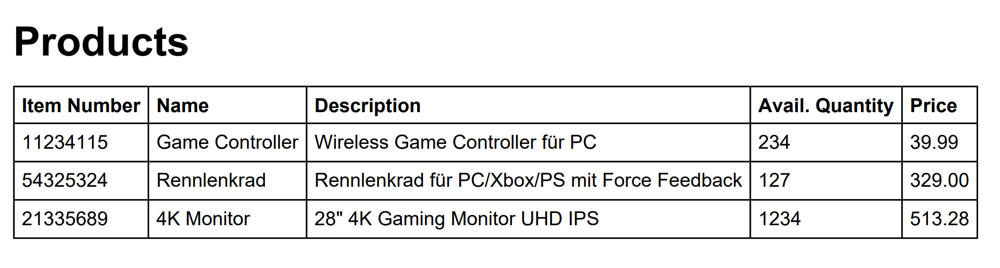

# Übung 7 – Medienverarbeitung

HYP2UE_T1 Hypermedia 2 Serverseitige Programmierung | 06.05.2024 | Wolfgang Hochleitner | Abgabe

In dieser Übung soll eine Applikation, basierend auf `fhooe/router-skeleton`, erstellt werden, die eine Liste an
Produkten aus einer Datenbank in die Formate XML, JSON und PDF exportieren kann. Alle drei exportierten Formate werden
im Verzeichnis `/public` gespeichert.

## Den Startercode zum Laufen bringen

Zunächst muss der Startercode im Ordner `exporter` lauffähig gemacht werden. Es handelt sich dabei um ein auf
*fhooe/router-skeleton* basierendes Projekt. Folgende Dinge sind zu tun.

1. Basispfad in `public/index.php` in Zeile 52 anpassen.
2. Dependencies installieren: zunächst eine Bash-Shell in den Docker-Container
   öffnen: `docker exec -it webapp /bin/bash`, dann in den Ordner des Projekts und den Unterordner `exporter`
   wechseln: `cd t1-ue07-YourTeamName/exporter`. Nun mit `composer install` die Dependencies installieren. Dies erzeugt
   den `vendor`-Ordner.
3. Projekt wie gewohnt aufrufen (zum Ordner `public` navigieren).
   Z.B. http://localhost:8080/t1-ue07-YourTeamName/exporter/public/. Die Index-Route wird angezeigt.
4. Sollte eine Fehlermeldung über fehlende Rechte zum Schreiben der Log-Datei angezeigt werden, so erteilen Sie dem
   gesamten Ordner `t1-ue07-YourTeamName` und allen Unterordnern mit folgendem Befehl entsprechende Rechte:
   ```bash
   chmod -R 777 .
   ```

## Datenbank erzeugen

Um ihre Datenbank mit Beispieldaten zu befüllen, rufen Sie die Route `/createdb` auf. Sie erzeugt zunächst die
Datenbank "ue07_products", legt dann eine Tabelle "product" and und fügt in diese drei Beispielprodukte sein. Die
Tabelle mit den Beispieldaten sieht wie folgt aus:

| id (PK) | item_nr  | product_name    | product_description                           | available_quantity | price  |
|---------|----------|-----------------|-----------------------------------------------|--------------------|--------|
| 1       | 11234115 | Game Controller | Wireless Game Controller für PC               | 234                | 39.99  |
| 2       | 54325324 | Rennlenkrad     | Rennlenkrad für PC/Xbox/PS mit Force Feedback | 127                | 329.00 |
| 3       | 21335689 | 4K Monitor      | 28" 4K Gaming Monitor UHD IPS                 | 1234               | 513.28 |

## Den Exporter umsetzen

Nachdem das Basisprojekt nun läuft, kann mit der Umsetzung des Exporters begonnen werden. Anpassungen sind zunächst
in `public/index.php` für die Routen notwendig. Der eigentliche Export in unterschiedliche Formate geschieht in der
Klasse `src/HYP2UE07/ProductExporter.php`.

### Routen anpassen

Die Routen `/xml`, `/json` und `/pdf` existieren bereits in `public/index.php`. Legen Sie im Callback der jeweiligen
Route ein Objekt der Klasse `ProductExporter` an und übergeben Sie ihm das Twig-Objekt, damit Sie später Output anzeigen
können.

Rufen Sie in weiterer Folge die Methode `export(ExportFormat $format, string $filename)` auf.

Der erste Parameter ist ein in [Enum](https://www.php.net/manual/de/language.types.enumerations.php), der genau 3 Werte,
nämlich XML, JSON oder PDF annehmen kann. Damit lässt sich der gewünschte zu exportierende Typ steuern. Der Enum hat
dabei (z.B. gegenüber einem String) den Vorteil, dass außer diesen drei Werten nichts zulässig ist. Somit muss hier
keine Überprüfung auf mögliche ungültige Werte durchgeführt werden.

Der zweite Parameter ist der Dateiname. Wählen Sie einen beliebigen Namen mit der korrekten Endung für das jeweilige
Format.

Rufen Sie schließlich noch `displayOutput()` auf, um nach dem Export ein Template anzeigen zu können.

### Klasse `ProductExporter`

Diese Klasse übernimmt die Arbeit des Konvertierens in verschiedene Formate. Im Konstruktor wird bereits das Twig-Objekt
einer Eigenschaft zugewiesen und die Datenbank initialisiert.

#### Methode `export(ExportFormat $format, string $filename)`

Diese Methode wird in jeder der Routen aufgerufen und startet den Export. Der Parameter steuert das gewünschte Format.

Rufen Sie anhand des übergebenen Arguments für `$format` die jeweilige private Exportmethode auf:

- `exportXML(array $products, string $filename)` um ein XML-Dokument zu erzeugen,
- `exportJSON(array $products, string $filename)` um ein JSON-Dokument zu erzeugen,
- `exportPDF(array $products, string $filename)` um ein PDF-Dokument zu erzeugen,

Diese Methoden erhalten ein Array mit den Produkten (`$products`). Um dieses zu bekommen, müssen Sie die Produkte aus
der Datenbank zuvor abfragen.

#### Methode `exportXML(array $products, string $filename)`

Diese Methode erzeugt eine XML-Datei. Verwenden Sie dazu, wie in der Vorlesung gezeigt, `XMLWriter` oder `DOM` um eine
XML-Struktur zu erstellen und in eine Datei zu speichern.

Die fertige XML-Datei soll dabei wie folgt aufgebaut sein:

```xml
<?xml version="1.0" encoding="UTF-8"?>
<products>
    <product>
        <item_nr>11234115</item_nr>
        <product_name>Game Controller</product_name>
        <product_description>Wireless Game Controller für PC</product_description>
        <available_quantity>234</available_quantity>
        <price>39.99</price>
    </product>
    <product>
        <item_nr>54325324</item_nr>
        <product_name>Rennlenkrad</product_name>
        <product_description>Rennlenkrad für PC/Xbox/PS mit Force Feedback</product_description>
        <available_quantity>127</available_quantity>
        <price>329.00</price>
    </product>
    <product>
        <item_nr>21335689</item_nr>
        <product_name>4K Monitor</product_name>
        <product_description>28&quot; 4K Gaming Monitor UHD IPS</product_description>
        <available_quantity>1234</available_quantity>
        <price>513.28</price>
    </product>
</products>
```

#### Methode `exportJSON(array $products, string $filename)`

Diese Methode erzeugt eine JSON-Datei. Verwenden Sie `json_encode()`, um eine JSON-Struktur zu erzeugen und schreiben
Sie diese mit `file_put_contents()` in eine Datei.

Die JSON-Datei soll folgendermaßen aufgebaut sein:

```json
{
  "products": [
    {
      "item_nr": "11234115",
      "product_name": "Game Controller",
      "product_description": "Wireless Game Controller für PC",
      "available_quantity": "234",
      "price": "39.99"
    },
    {
      "item_nr": "54325324",
      "product_name": "Rennlenkrad",
      "product_description": "Rennlenkrad für PC/Xbox/PS mit Force Feedback",
      "available_quantity": "127",
      "price": "329.00"
    },
    {
      "item_nr": "21335689",
      "product_name": "4K Monitor",
      "product_description": "28\" 4K Gaming Monitor UHD IPS",
      "available_quantity": "1234",
      "price": "513.28"
    }
  ]
}
```

#### Methode `exportPDF(array $products, string $filename)`

Diese Methode erzeugt eine PDF-Datei. Verwenden Sie HTML2PDF oder TCPDF um eine Überschrift und eine Tabelle mit den
Produkten zu erzeugen.

Die PDF-Datei soll so aufgebaut sein:

|  |
|:-----------------------------------------------------------------------------------:|
|                  **Das PDF enthält die Produktdaten als Tabelle.**                  |

## Tipps und Richtlinien

- Das HTML-Fragment für die PDF-Ausgabe lässt sich mit Twig erstellen. Um das Template in einen String zu rendern (der
  dann an den PDF-Generator übergeben wird), muss die Methode `render($template, $params)` verwendet werden.
- Bei Fragen oder Problemen zur Aufgabe eröffnen Sie ein Issue in ihrem Repository.